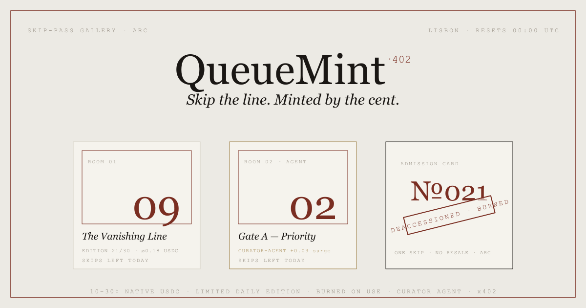

`CAT. №14`  ·  `ARC TESTNET`  ·  `ON VIEW` → **[queuemint-arc.vercel.app](https://queuemint-arc.vercel.app)**

# QueueMint
### a standing exhibition of skip-the-line passes

---

### Wall text

A queue is a tax on time, collected in the one currency you can't earn back. The usual ways out are
broken: paper fast-passes are sold in secret and oversold until the fast lane is a line too; premium tiers
ask for $99 a year when all you wanted was *one* skip, *once*; and none of it can be bought by a piece of
software at all.

QueueMint hangs each queue on the wall as a framed piece. The operator opens a **limited edition for the
day**; a visitor — a person, or an agent — acquires a single skip-pass for **ten to thirty cents** of native
USDC. The pass is bound to its holder and to the day, and it is **struck and burned** the moment it's used at
the front of the line. One skip. No second printing. No resale once cancelled.

The edition size is a public number on the wall, not a figure in a back office. The price is set, in the
open, by a curator. And the whole thing costs cents — which is the part that only works here.

### On loan from Arc

Thirty cents is not a price you can charge on a chain where gas is a separate, swinging token: the fee eats
the sale, and an *agent* paying cents all day is a non-starter. Arc makes native USDC the gas **and** the
money — a mint costs roughly its own face value plus a sliver, micro-pricing is coherent, and software can
pay its own way. Take that away and QueueMint is just an expensive, human-only turnstile. Here it's a
self-pricing, burn-on-use line-skip market.

### The curators

Two pieces of software keep the gallery running.

> **⟡ The curator** — an autonomous wallet, appointed per venue, that opens each day's edition and lets the
> price *breathe*: surging toward 30¢ as a run sells out, decaying toward 10¢ when the hall is quiet — every
> move on-chain. It is allowed to set size and price and **nothing else**: it can never touch a cent, mint a
> pass, or print beyond the venue's permanent daily ceiling. → [`agent/curator.mjs`](agent/curator.mjs)

> **▣ The doorman, via x402** — priority access offered as a paid HTTP endpoint. An agent pays the micro-fee
> over the genuine **x402** (`402` / `X-PAYMENT` / `X-PAYMENT-RESPONSE`) handshake and receives a skip-pass
> with no wallet UI. Honest about the medium: Arc's USDC is the *native* coin, so this is **pay-then-prove** —
> the agent mints through the contract and proves it with the transaction; the server reads the `Minted` event
> on-chain. Real wire format, self-verified, no facilitator, not the gasless EIP-3009 variant.
> → [`app/api/x402/skip/[venueId]/route.ts`](app/api/x402/skip/%5BvenueId%5D/route.ts) · demo
> [`agent/skip-demo.mjs`](agent/skip-demo.mjs)

### Provenance & specifications

[`QueueMint.sol`](contracts/QueueMint.sol) is a self-contained ERC-721-lite — no OpenZeppelin, no owner, no
admin, no fee, no upgrade. Passes are deliberately **non-transferable**; a mint forwards **100%** to the venue
owner so the contract is never a vault; the burn is triple-locked. Two independent adversarial reviews cleared
it before it was hung — zero money-safety findings.

```
medium ........ native USDC on ARC testnet (chain 5042002)
accession ..... 0x96C81dE4a39463541d5300a500e48e5992A5B17F   (verified, ArcScan)
edition ....... one limited print run per venue, per UTC day
condition ..... burned on use · non-transferable · custody-free
```

### Visiting

```bash
npm install
npm run dev          # the gallery opens at http://localhost:3000
```

Hang a venue, open its edition, acquire a pass, and redeem it to watch the cancellation stamp fall. To let
the curator price the room, set a venue's agent and run `agent/curator.mjs` from a wallet holding a little
USDC for gas.

### Colophon

Next.js 16 · React 19 · ethers v6 · Solidity 0.8.35 · Tailwind v4. Typeset in Prata & Overpass Mono. Built in
Lisbon, settled on Arc.
